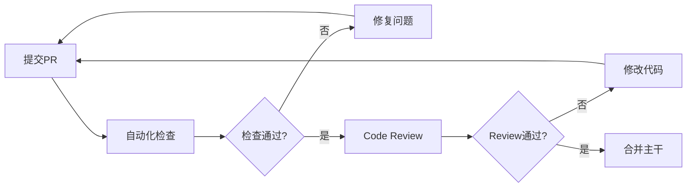

# Review和测试指导

## 一、代码Review流程

### 1.1 Review检查清单

**功能性**
- [ ] 代码实现了需求的所有功能点
- [ ] 边界条件和异常情况都有处理
- [ ] 输入验证完整
- [ ] 错误处理恰当

**代码质量**
- [ ] 命名清晰且符合规范
- [ ] 函数职责单一，长度合理（< 50行）
- [ ] 无重复代码（DRY原则）
- [ ] 注释充分且有意义
- [ ] 类型注解完整

**性能**
- [ ] 无明显的性能问题
- [ ] 数据库查询优化（避免N+1）
- [ ] 大文件/数据流式处理
- [ ] 适当使用缓存

**安全**
- [ ] 无SQL注入风险
- [ ] 无XSS漏洞
- [ ] 文件上传有验证
- [ ] 敏感信息不在代码中

**测试**
- [ ] 有对应的单元测试
- [ ] 测试覆盖率 >= 80%
- [ ] 测试用例充分
- [ ] 测试通过

### 1.2 Review工作流



**步骤说明**:

1. **开发者提交PR**
   - 创建feature分支
   - 完成开发和自测
   - 提交Pull Request

2. **自动化检查** (CI Pipeline)
   ```yaml
   # .github/workflows/ci.yml
   name: CI

   on: [pull_request]

   jobs:
     test:
       runs-on: ubuntu-latest
       steps:
         - uses: actions/checkout@v2

         # 代码格式检查
         - name: Lint
           run: |
             black --check backend/
             flake8 backend/

         # 类型检查
         - name: Type Check
           run: mypy backend/

         # 运行测试
         - name: Test
           run: pytest --cov=backend --cov-report=xml

         # 检查覆盖率
         - name: Coverage
           run: |
             coverage report --fail-under=80
   ```

3. **人工Review**
   - 至少一位团队成员Review
   - 使用Review检查清单
   - 留下具体、建设性的评论

4. **修改和讨论**
   - 开发者根据反馈修改
   - 回复Review评论
   - 解决所有conversations

5. **合并**
   - 所有检查通过
   - Review批准
   - Squash merge到主干

### 1.3 Review评论模板

**好的评论示例**:

```
# 建议优化
这里可以使用列表推导式简化代码：
```python
# 当前代码
persons = []
for detection in detections:
    if detection.confidence > 0.5:
        persons.append(detection)

# 建议
persons = [d for d in detections if d.confidence > 0.5]
```

**问题**: 这里没有处理video_path为None的情况，会抛出异常
**建议**: 在函数开始添加参数验证
```python
if video_path is None or not video_path.exists():
    raise ValueError(f"Invalid video path: {video_path}")
```

**优点**: 这个抽象设计很好，便于后续扩展新的Agent

## 二、测试策略

### 2.1 测试金字塔

```
        /\
       /  \
      / E2E\      少量（5-10个核心流程）
     /------\
    /        \
   / 集成测试 \    中等（20-30个接口/交互测试）
  /----------\
 /            \
/  单元测试     \  大量（100+个函数/类测试）
/--------------\
```

### 2.2 测试环境配置

**安装测试依赖**
```bash
# requirements-dev.txt
pytest==7.4.0
pytest-asyncio==0.21.0
pytest-cov==4.1.0
pytest-mock==3.11.1
httpx==0.24.1  # 用于测试FastAPI
faker==19.2.0  # 生成测试数据
```

**Pytest配置**
```ini
# pytest.ini
[pytest]
testpaths = tests
python_files = test_*.py
python_classes = Test*
python_functions = test_*
asyncio_mode = auto
addopts =
    --cov=backend
    --cov-report=html
    --cov-report=term-missing
    --verbose
```

## 三、单元测试

### 3.1 测试结构

```
tests/
├── unit/                   # 单元测试
│   ├── agents/
│   │   ├── test_lead_agent.py
│   │   ├── test_detection_agent.py
│   │   ├── test_recognition_agent.py
│   │   └── test_keyframe_agent.py
│   ├── api/
│   │   └── test_video_routes.py
│   └── core/
│       └── test_video_processor.py
├── integration/            # 集成测试
│   ├── test_video_pipeline.py
│   └── test_api_endpoints.py
├── e2e/                    # 端到端测试
│   └── test_full_workflow.py
├── fixtures/               # 测试数据
│   ├── test_video.mp4
│   └── test_image.jpg
└── conftest.py            # Pytest配置和fixtures
```

### 3.2 Fixtures定义

```python
# tests/conftest.py
import pytest
from pathlib import Path
from unittest.mock import Mock, AsyncMock
from sqlalchemy.ext.asyncio import create_async_engine, AsyncSession
from backend.models import Base

@pytest.fixture
def test_video_path():
    """测试视频路径"""
    return Path(__file__).parent / "fixtures" / "test_video.mp4"

@pytest.fixture
def mock_storage():
    """Mock存储客户端"""
    storage = Mock()
    storage.save = AsyncMock(return_value="/path/to/saved/file.jpg")
    storage.load = AsyncMock(return_value=b"image_data")
    return storage

@pytest.fixture
async def db_session():
    """测试数据库会话"""
    engine = create_async_engine("sqlite+aiosqlite:///:memory:")

    async with engine.begin() as conn:
        await conn.run_sync(Base.metadata.create_all)

    async with AsyncSession(engine) as session:
        yield session

    await engine.dispose()

@pytest.fixture
def sample_detections():
    """示例检测数据"""
    return {
        'persons': [
            {
                'frame_index': 10,
                'timestamp': 0.33,
                'bbox': [100, 100, 200, 300],
                'confidence': 0.95
            },
            {
                'frame_index': 20,
                'timestamp': 0.67,
                'bbox': [150, 120, 250, 320],
                'confidence': 0.92
            }
        ],
        'faces': [],
        'tracks': {}
    }
```

### 3.3 Agent单元测试

**DetectionAgent测试**
```python
# tests/unit/agents/test_detection_agent.py
import pytest
from backend.core.agents import DetectionAgent
from pathlib import Path

class TestDetectionAgent:
    """DetectionAgent单元测试"""

    @pytest.fixture
    def agent(self):
        """创建DetectionAgent实例"""
        return DetectionAgent(model_name="yolov8n")

    @pytest.mark.asyncio
    async def test_detect_persons_success(self, agent, test_video_path):
        """测试成功检测人物"""
        result = await agent.detect_persons(
            video_path=test_video_path,
            sample_rate=10
        )

        assert 'persons' in result
        assert 'faces' in result
        assert 'tracks' in result
        assert isinstance(result['persons'], list)
        assert result['total_frames_processed'] > 0

    @pytest.mark.asyncio
    async def test_detect_persons_empty_video(self, agent, tmp_path):
        """测试空视频处理"""
        # 创建空视频文件
        empty_video = tmp_path / "empty.mp4"
        empty_video.touch()

        with pytest.raises(Exception):
            await agent.detect_persons(empty_video)

    def test_extract_face_success(self, agent):
        """测试人脸提取"""
        import numpy as np

        # 创建测试图像
        frame = np.zeros((480, 640, 3), dtype=np.uint8)
        bbox = [100, 100, 200, 300]

        face = agent._extract_face(frame, bbox)

        # 可能提取到人脸，也可能没有（取决于测试图像）
        assert face is None or isinstance(face, np.ndarray)

    def test_build_tracks(self, agent):
        """测试轨迹构建"""
        persons = [
            {'frame_index': 1, 'track_id': 1},
            {'frame_index': 2, 'track_id': 1},
            {'frame_index': 3, 'track_id': 2},
        ]

        tracks = agent._build_tracks(persons)

        assert len(tracks) == 2
        assert len(tracks[1]) == 2
        assert len(tracks[2]) == 1
```

**LeadAgent测试**
```python
# tests/unit/agents/test_lead_agent.py
import pytest
from unittest.mock import AsyncMock, Mock
from backend.core.agents import LeadAgent

class TestLeadAgent:
    """LeadAgent单元测试"""

    @pytest.fixture
    def mock_agents(self):
        """Mock所有Execution Agents"""
        return {
            'detection': Mock(
                detect_persons=AsyncMock(return_value={
                    'persons': [], 'faces': [], 'tracks': {}
                })
            ),
            'recognition': Mock(
                cluster_faces=AsyncMock(return_value={
                    'clusters': {}, 'main_characters': []
                })
            ),
            'keyframe': Mock(
                extract_keyframes=AsyncMock(return_value=[])
            )
        }

    @pytest.fixture
    def lead_agent(self, mock_agents, db_session):
        """创建LeadAgent实例"""
        return LeadAgent(
            detection_agent=mock_agents['detection'],
            recognition_agent=mock_agents['recognition'],
            keyframe_agent=mock_agents['keyframe'],
            db_session=db_session
        )

    @pytest.mark.asyncio
    async def test_process_video_success(
        self,
        lead_agent,
        test_video_path,
        mock_agents
    ):
        """测试完整视频处理流程"""
        result = await lead_agent.process_video(
            video_id="test-123",
            video_path=test_video_path
        )

        # 验证所有Agent都被调用
        mock_agents['detection'].detect_persons.assert_called_once()
        mock_agents['keyframe'].extract_keyframes.assert_called_once()

        assert result is not None

    @pytest.mark.asyncio
    async def test_analyze_video(self, lead_agent, test_video_path):
        """测试视频元信息分析"""
        metadata = await lead_agent._analyze_video(test_video_path)

        assert metadata.duration > 0
        assert metadata.fps > 0
        assert metadata.width > 0
        assert metadata.height > 0
        assert metadata.total_frames > 0

    def test_create_plan_short_video(self, lead_agent):
        """测试短视频处理计划"""
        from backend.core.agents.lead_agent import VideoMetadata

        metadata = VideoMetadata(
            duration=5.0,
            fps=30,
            width=1920,
            height=1080,
            total_frames=150,
            format=".mp4"
        )

        plan = lead_agent._create_plan(metadata, None)

        assert plan.sample_rate == 1  # 短视频全部处理
        assert plan.enable_scene_detection == False  # 太短不需要场景检测
        assert plan.enable_face_clustering == True  # HD视频启用

    def test_create_plan_long_video(self, lead_agent):
        """测试长视频处理计划"""
        from backend.core.agents.lead_agent import VideoMetadata

        metadata = VideoMetadata(
            duration=300.0,  # 5分钟
            fps=30,
            width=1920,
            height=1080,
            total_frames=9000,
            format=".mp4"
        )

        plan = lead_agent._create_plan(metadata, None)

        assert plan.sample_rate >= 1  # 长视频需要采样
        assert plan.enable_scene_detection == True
```

### 3.4 API测试

```python
# tests/unit/api/test_video_routes.py
import pytest
from httpx import AsyncClient
from backend.main import app

@pytest.mark.asyncio
async def test_upload_video_success():
    """测试视频上传成功"""
    async with AsyncClient(app=app, base_url="http://test") as client:
        # 准备测试文件
        files = {
            "file": ("test.mp4", open("tests/fixtures/test_video.mp4", "rb"), "video/mp4")
        }

        response = await client.post("/api/videos/upload", files=files)

        assert response.status_code == 200
        data = response.json()
        assert "video_id" in data
        assert "task_id" in data
        assert data["status"] == "processing"

@pytest.mark.asyncio
async def test_upload_invalid_format():
    """测试上传无效格式文件"""
    async with AsyncClient(app=app, base_url="http://test") as client:
        files = {
            "file": ("test.txt", b"not a video", "text/plain")
        }

        response = await client.post("/api/videos/upload", files=files)

        assert response.status_code == 400
        data = response.json()
        assert "error" in data

@pytest.mark.asyncio
async def test_get_video_status():
    """测试查询视频处理状态"""
    async with AsyncClient(app=app, base_url="http://test") as client:
        video_id = "test-video-123"

        response = await client.get(f"/api/videos/{video_id}/status")

        assert response.status_code in [200, 404]
```

## 四、集成测试

### 4.1 Pipeline集成测试

```python
# tests/integration/test_video_pipeline.py
import pytest
from pathlib import Path
from backend.core.agents import LeadAgent, DetectionAgent, RecognitionAgent, KeyframeAgent

@pytest.mark.asyncio
async def test_full_pipeline_integration(db_session, mock_storage, test_video_path):
    """测试完整处理流水线集成"""

    # 创建真实的Agent实例（不使用Mock）
    detection_agent = DetectionAgent()
    recognition_agent = RecognitionAgent()
    keyframe_agent = KeyframeAgent(mock_storage)

    lead_agent = LeadAgent(
        detection_agent,
        recognition_agent,
        keyframe_agent,
        db_session
    )

    # 执行完整流程
    result = await lead_agent.process_video(
        video_id="integration-test-001",
        video_path=test_video_path,
        options={'max_keyframes': 10}
    )

    # 验证结果
    assert result is not None
    assert 'keyframes' in result or 'message' in result

@pytest.mark.asyncio
async def test_agent_communication(db_session):
    """测试Agent之间的数据传递"""
    from unittest.mock import Mock, AsyncMock

    # Mock DetectionAgent返回特定数据
    detection_agent = Mock()
    detection_agent.detect_persons = AsyncMock(return_value={
        'persons': [
            {'frame_index': 10, 'timestamp': 0.33, 'bbox': [100, 100, 200, 300]}
        ],
        'faces': [
            {'frame_index': 10, 'face_image': b'fake_image_data'}
        ],
        'tracks': {}
    })

    # Mock RecognitionAgent
    recognition_agent = Mock()
    recognition_agent.cluster_faces = AsyncMock(return_value={
        'clusters': {0: {'faces': [], 'count': 1}},
        'main_characters': []
    })

    # Mock KeyframeAgent验证接收到正确的数据
    keyframe_agent = Mock()
    keyframe_agent.extract_keyframes = AsyncMock(return_value=[])

    lead_agent = LeadAgent(
        detection_agent,
        recognition_agent,
        keyframe_agent,
        db_session
    )

    await lead_agent.process_video(
        "test-comm",
        Path("dummy.mp4")
    )

    # 验证KeyframeAgent收到了DetectionAgent的数据
    call_args = keyframe_agent.extract_keyframes.call_args
    assert 'detections' in call_args.kwargs
    assert len(call_args.kwargs['detections']['persons']) == 1
```

### 4.2 数据库集成测试

```python
# tests/integration/test_database.py
import pytest
from backend.models import Video, Keyframe
from sqlalchemy import select

@pytest.mark.asyncio
async def test_create_video_record(db_session):
    """测试创建视频记录"""
    video = Video(
        id="test-video-001",
        file_path="/path/to/video.mp4",
        status="pending",
        progress=0
    )

    db_session.add(video)
    await db_session.commit()

    # 查询验证
    result = await db_session.execute(
        select(Video).where(Video.id == "test-video-001")
    )
    saved_video = result.scalar_one()

    assert saved_video.id == "test-video-001"
    assert saved_video.status == "pending"

@pytest.mark.asyncio
async def test_video_keyframe_relationship(db_session):
    """测试视频和关键帧的关联关系"""
    video = Video(id="test-vid", file_path="/path")
    db_session.add(video)

    keyframe1 = Keyframe(
        id="kf-1",
        video_id="test-vid",
        frame_index=10,
        image_url="/path/frame10.jpg"
    )
    keyframe2 = Keyframe(
        id="kf-2",
        video_id="test-vid",
        frame_index=20,
        image_url="/path/frame20.jpg"
    )

    db_session.add_all([keyframe1, keyframe2])
    await db_session.commit()

    # 查询关联数据
    result = await db_session.execute(
        select(Video).where(Video.id == "test-vid")
    )
    video = result.scalar_one()

    # 验证关联
    assert len(video.keyframes) == 2
```

## 五、端到端测试

### 5.1 完整用户流程测试

```python
# tests/e2e/test_full_workflow.py
import pytest
from httpx import AsyncClient
from backend.main import app
import asyncio

@pytest.mark.e2e
@pytest.mark.asyncio
async def test_complete_user_workflow():
    """
    测试完整的用户工作流:
    1. 上传视频
    2. 等待处理完成
    3. 获取关键帧列表
    4. 下载关键帧
    """
    async with AsyncClient(app=app, base_url="http://test", timeout=300.0) as client:
        # 1. 上传视频
        with open("tests/fixtures/test_video.mp4", "rb") as f:
            files = {"file": ("test.mp4", f, "video/mp4")}
            upload_response = await client.post("/api/videos/upload", files=files)

        assert upload_response.status_code == 200
        video_id = upload_response.json()["video_id"]

        # 2. 轮询处理状态
        max_wait = 60  # 最多等待60秒
        for _ in range(max_wait):
            status_response = await client.get(f"/api/videos/{video_id}/status")
            status = status_response.json()["status"]

            if status == "completed":
                break
            elif status == "failed":
                pytest.fail("Video processing failed")

            await asyncio.sleep(1)
        else:
            pytest.fail("Video processing timeout")

        # 3. 获取关键帧列表
        keyframes_response = await client.get(f"/api/videos/{video_id}/keyframes")
        assert keyframes_response.status_code == 200

        keyframes = keyframes_response.json()["keyframes"]
        assert len(keyframes) > 0

        # 4. 下载第一个关键帧
        first_keyframe = keyframes[0]
        download_response = await client.get(first_keyframe["image_url"])
        assert download_response.status_code == 200
        assert len(download_response.content) > 0
```

### 5.2 性能测试

```python
# tests/e2e/test_performance.py
import pytest
import time
from httpx import AsyncClient
from backend.main import app

@pytest.mark.performance
@pytest.mark.asyncio
async def test_api_response_time():
    """测试API响应时间"""
    async with AsyncClient(app=app, base_url="http://test") as client:
        start = time.time()
        response = await client.get("/api/health")
        duration = time.time() - start

        assert response.status_code == 200
        assert duration < 0.1  # 健康检查应在100ms内响应

@pytest.mark.performance
@pytest.mark.asyncio
async def test_concurrent_uploads():
    """测试并发上传处理能力"""
    async with AsyncClient(app=app, base_url="http://test") as client:
        # 准备10个并发上传任务
        async def upload_task():
            with open("tests/fixtures/test_video.mp4", "rb") as f:
                files = {"file": ("test.mp4", f, "video/mp4")}
                return await client.post("/api/videos/upload", files=files)

        start = time.time()

        # 并发执行
        import asyncio
        tasks = [upload_task() for _ in range(10)]
        responses = await asyncio.gather(*tasks)

        duration = time.time() - start

        # 验证
        assert all(r.status_code == 200 for r in responses)
        assert duration < 10  # 10个上传应在10秒内完成
```

## 六、测试数据管理

### 6.1 使用Faker生成测试数据

```python
# tests/factories.py
from faker import Faker
from datetime import datetime
import uuid

fake = Faker()

class VideoFactory:
    """视频测试数据工厂"""

    @staticmethod
    def create(**kwargs):
        defaults = {
            'id': str(uuid.uuid4()),
            'file_path': fake.file_path(extension='mp4'),
            'status': 'pending',
            'progress': 0,
            'created_at': datetime.utcnow()
        }
        defaults.update(kwargs)
        return defaults

class KeyframeFactory:
    """关键帧测试数据工厂"""

    @staticmethod
    def create(**kwargs):
        defaults = {
            'id': str(uuid.uuid4()),
            'video_id': str(uuid.uuid4()),
            'frame_index': fake.random_int(0, 1000),
            'timestamp': fake.pyfloat(min_value=0, max_value=100),
            'image_url': fake.image_url(),
            'bbox': [
                fake.random_int(0, 500),
                fake.random_int(0, 500),
                fake.random_int(500, 1000),
                fake.random_int(500, 1000)
            ]
        }
        defaults.update(kwargs)
        return defaults

# 使用示例
def test_with_factory():
    video_data = VideoFactory.create(status='completed')
    assert video_data['status'] == 'completed'
```

### 6.2 测试视频准备

```bash
# 使用FFmpeg生成测试视频
# tests/fixtures/generate_test_videos.sh

#!/bin/bash

# 生成5秒钟的测试视频（纯色+噪点）
ffmpeg -f lavfi -i testsrc=duration=5:size=1280x720:rate=30 \
    -c:v libx264 -pix_fmt yuv420p \
    tests/fixtures/test_video_short.mp4

# 生成30秒的测试视频（包含场景切换）
ffmpeg -f lavfi -i testsrc=duration=30:size=1920x1080:rate=30 \
    -c:v libx264 -pix_fmt yuv420p \
    tests/fixtures/test_video_long.mp4

# 生成低分辨率视频
ffmpeg -f lavfi -i testsrc=duration=10:size=640x480:rate=24 \
    -c:v libx264 -pix_fmt yuv420p \
    tests/fixtures/test_video_lowres.mp4
```

## 七、持续集成

### 7.1 GitHub Actions配置

```yaml
# .github/workflows/test.yml
name: Test Suite

on:
  push:
    branches: [main, develop]
  pull_request:
    branches: [main, develop]

jobs:
  test:
    runs-on: ubuntu-latest

    services:
      redis:
        image: redis:7
        ports:
          - 6379:6379

      postgres:
        image: postgres:15
        env:
          POSTGRES_PASSWORD: test
          POSTGRES_DB: testdb
        ports:
          - 5432:5432

    steps:
      - uses: actions/checkout@v3

      - name: Set up Python
        uses: actions/setup-python@v4
        with:
          python-version: '3.10'

      - name: Cache dependencies
        uses: actions/cache@v3
        with:
          path: ~/.cache/pip
          key: ${{ runner.os }}-pip-${{ hashFiles('requirements*.txt') }}

      - name: Install dependencies
        run: |
          pip install -r requirements.txt
          pip install -r requirements-dev.txt

      - name: Lint
        run: |
          black --check backend/
          flake8 backend/
          mypy backend/

      - name: Run unit tests
        run: |
          pytest tests/unit/ -v --cov=backend --cov-report=xml

      - name: Run integration tests
        run: |
          pytest tests/integration/ -v

      - name: Upload coverage
        uses: codecov/codecov-action@v3
        with:
          files: ./coverage.xml
          flags: unittests

  e2e-test:
    runs-on: ubuntu-latest
    needs: test

    steps:
      - uses: actions/checkout@v3

      - name: Build Docker images
        run: docker-compose build

      - name: Start services
        run: docker-compose up -d

      - name: Wait for services
        run: |
          sleep 10
          curl --retry 10 --retry-delay 5 http://localhost:8000/health

      - name: Run E2E tests
        run: |
          docker-compose exec -T backend pytest tests/e2e/ -v

      - name: Stop services
        run: docker-compose down
```

### 7.2 Pre-commit钩子

```yaml
# .pre-commit-config.yaml
repos:
  - repo: https://github.com/psf/black
    rev: 23.3.0
    hooks:
      - id: black
        language_version: python3.10

  - repo: https://github.com/pycqa/flake8
    rev: 6.0.0
    hooks:
      - id: flake8
        args: ['--max-line-length=100']

  - repo: https://github.com/pycqa/isort
    rev: 5.12.0
    hooks:
      - id: isort
        args: ['--profile', 'black']

  - repo: https://github.com/pre-commit/mirrors-mypy
    rev: v1.3.0
    hooks:
      - id: mypy
        additional_dependencies: [types-all]

  - repo: local
    hooks:
      - id: pytest-check
        name: pytest-quick
        entry: pytest tests/unit/ -x
        language: system
        pass_filenames: false
        always_run: true
```

安装钩子:
```bash
pip install pre-commit
pre-commit install
```

## 八、测试覆盖率报告

### 8.1 生成覆盖率报告

```bash
# 运行测试并生成覆盖率报告
pytest --cov=backend --cov-report=html --cov-report=term

# 查看HTML报告
open htmlcov/index.html
```

### 8.2 覆盖率要求

**最低要求**:
- 整体覆盖率: >= 80%
- 核心模块(agents, core): >= 90%
- API路由: >= 85%
- 工具函数: >= 75%

**检查脚本**:
```python
# scripts/check_coverage.py
import sys
import xml.etree.ElementTree as ET

def check_coverage(xml_file, threshold=0.8):
    tree = ET.parse(xml_file)
    root = tree.getroot()

    line_rate = float(root.attrib['line-rate'])
    branch_rate = float(root.attrib['branch-rate'])

    print(f"Line coverage: {line_rate * 100:.2f}%")
    print(f"Branch coverage: {branch_rate * 100:.2f}%")

    if line_rate < threshold:
        print(f"❌ Coverage {line_rate*100:.2f}% is below threshold {threshold*100}%")
        sys.exit(1)
    else:
        print(f"✅ Coverage meets threshold")
        sys.exit(0)

if __name__ == "__main__":
    check_coverage("coverage.xml")
```

## 九、测试最佳实践

### 9.1 测试原则

1. **FIRST原则**
   - **F**ast: 测试要快速
   - **I**ndependent: 测试之间独立
   - **R**epeatable: 可重复执行
   - **S**elf-Validating: 自动验证结果
   - **T**imely: 及时编写测试

2. **AAA模式**
   ```python
   async def test_example():
       # Arrange (准备)
       agent = DetectionAgent()
       video_path = Path("test.mp4")

       # Act (执行)
       result = await agent.detect_persons(video_path)

       # Assert (断言)
       assert len(result['persons']) > 0
   ```

3. **一个测试一个断言** (推荐但不强制)
   ```python
   def test_video_metadata_duration():
       metadata = analyze_video("test.mp4")
       assert metadata.duration > 0

   def test_video_metadata_fps():
       metadata = analyze_video("test.mp4")
       assert metadata.fps == 30
   ```

### 9.2 常见陷阱

**❌ 测试实现细节而非行为**
```python
# 不好
def test_internal_cache():
    agent = DetectionAgent()
    assert agent._cache == {}  # 测试内部实现

# 好
def test_detection_performance():
    agent = DetectionAgent()
    result1 = agent.detect(frame)
    result2 = agent.detect(frame)  # 测试缓存效果
    assert result1 == result2
```

**❌ 测试之间有依赖**
```python
# 不好
def test_step1():
    global video_id
    video_id = upload_video()

def test_step2():
    result = process_video(video_id)  # 依赖test_step1

# 好
def test_upload_and_process():
    video_id = upload_video()
    result = process_video(video_id)
```

**❌ 过度Mock**
```python
# 不好 - Mock太多，测试失去意义
def test_with_too_many_mocks():
    agent = Mock()
    agent.detect = Mock(return_value=Mock())
    result = agent.detect(Mock())
    assert result is not None  # 没有测试实际逻辑

# 好 - 只Mock外部依赖
def test_with_minimal_mocks():
    storage = Mock()  # 外部依赖
    agent = DetectionAgent()  # 真实实例
    result = agent.detect(test_frame)
    assert len(result) > 0  # 测试真实行为
```

## 十、故障排查

### 10.1 常见测试问题

**问题1: 异步测试不执行**
```python
# 错误
def test_async_function():
    result = async_function()  # 返回coroutine对象，未执行

# 正确
@pytest.mark.asyncio
async def test_async_function():
    result = await async_function()
```

**问题2: Fixture作用域问题**
```python
# 数据库Fixture应该是function作用域，每个测试独立
@pytest.fixture(scope="function")  # 不要用session
async def db_session():
    ...
```

**问题3: 测试数据清理**
```python
@pytest.fixture
async def clean_database():
    yield
    # 测试后清理
    await clear_all_tables()
```

### 10.2 调试技巧

**使用pytest -pdb**
```bash
# 测试失败时进入调试器
pytest -x --pdb
```

**打印调试信息**
```python
def test_with_debug():
    result = some_function()
    print(f"Debug: result={result}")  # pytest -s 可见
    assert result > 0
```

**只运行特定测试**
```bash
# 运行特定文件
pytest tests/unit/agents/test_lead_agent.py

# 运行特定测试
pytest tests/unit/agents/test_lead_agent.py::test_process_video

# 运行匹配模式的测试
pytest -k "detection"
```

## 十一、Review Checklist总结

**提交PR前检查**:
- [ ] 所有测试通过 (`pytest`)
- [ ] 代码格式化 (`black backend/`)
- [ ] 类型检查通过 (`mypy backend/`)
- [ ] Lint检查通过 (`flake8 backend/`)
- [ ] 测试覆盖率 >= 80%
- [ ] 添加了必要的测试用例
- [ ] 更新了相关文档
- [ ] Commit message符合规范
- [ ] 没有调试代码(print, console.log等)
- [ ] 没有敏感信息(密码, token等)

**Review时检查**:
- [ ] 代码逻辑正确
- [ ] 边界条件处理
- [ ] 错误处理适当
- [ ] 性能考虑
- [ ] 安全性检查
- [ ] 可维护性
- [ ] 测试充分
